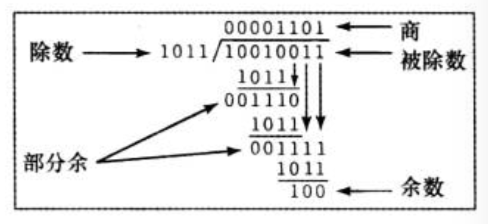

## 0、背景

前段时间高中同学聚会，酒过三旬，一个学医的同学向我们倒起了苦水。他说：“导师太抠了，试验用的小白鼠常常不够用。 “咋不够用呢？”我们顺着接话。“我们在研究一款药物致死剂量的时候，每次都要用掉很多小白鼠，实验室的那点根本就不够！”他略微带了点埋怨的语气说道。“哦？你们是怎么测试最小致死剂量的？”我好奇的问到。他说：“很简单，假设用药量的最小单位是1ml，我们先估摸着给小白鼠打一个较大剂量的，比如100ml，小白鼠死了，然后每次减小1ml，一直到药物剂量缩小到某个值后，小白鼠没死，那这就是小白鼠的最小致死量咯”。我漏出了得意的笑容，因为我知道是时候拯救这位同学了。于是，我给他讲起了二分查找...

尽管你已经很熟悉二分查找的思想了，但是我还是想简单介绍一下：

二分查找，也叫折半查找或对数查找。是属于信息检索下的一个子类。在21世纪的今天，人们离不开信息检索，小到在搜索引擎中查找关键字，大到利用机器学习、大数据处理从海量数据中提取有用信息，都是属于信息检索的一部分。既然产生了信息，就离不开对信息的查找。常见的查找算法有顺序查找、插值查找、树表查找、分块查找、哈希查找和二分查找等等，查找的目的也很简单——“快速、准确”。二分查找就是一种在有序数组中，查找出某一个特定元素的算法。该算法是在1946年由美国工程师约翰·莫奇利首次提出，此后该算法被迅速用于生活生产中的各个领域。也由此产生了很多变形。

二分查找的思想很简单，每次从集合中排除一半的元素，一直到找到该元素或者集合为空为止。听起来一句话就能说明白，但是想要彻底了解二分查找，却是有一定的技巧和难度的。下面，我们就从最简单的二分查找说起，一步步带你走进它的神秘世界，看看有多少是你未曾发现的领域~

## 1、大家来找茬

计算机始祖D.Knuth曾在《计算机程序设计的艺术 第3卷：排序和查找》中写道，二分查找虽然在1946年就已经诞生，但是直到十多年后的1962年，才有人写出没有bug的代码。这也就不难理解，为什么有的面试官说90%的程序员都写不出bug free 的代码。今天，我们就来看看这里面的坑到底有哪些。

先来看一段代码：

```java
public int binarySearch(int array[], int n, int value) {
        int low = 0;
        int high = n - 1;

        while (low < high) {
            int middle = (low + high) / 2;
          
            if (array[middle] > value) {
                high = middle - 1;
            } else if (array[middle] < value) {
                low = middle + 1;
            } else {
                return middle;
            }
        }
        return -1;
    }
```

这是一段很普通的二分查找代码。但是里面有好几个坑，你知道有哪些吗？

请先思考几分钟，再往下看答案。

根据以往经验，二分查找常见错误可以总结为以下几点：

###  1.1、搜索空间不全

根据low和high的初始赋值low = 0、high = n-1，我们可以知道这是一个在闭区间[low,high]里进行的搜索。即搜索的目标可能是array[low]，也可能是array[high]。但是，我们看看循环跳出的条件：low<high，这里就犯了一个错误，即low == high的情况被排除在外。从而导致了搜索遗漏。

比如，给出测试用例array = [1,2,3,4,5],value = 2。返回结果就是-1，代码认为没有找到目标元素。

### 1.2、整数溢出

这个问题稍微隐蔽一点，就是这段代码：

```java
int middle = (low + high) / 2;
```

一眼看去好像问题不大，但是这里面隐藏着一个惊天大bug——整数溢出。这个bug甚至在JDK中埋藏了好几年。我们知道，在jvm中，int占4字节，最大值为2<sup>32</sup> -1，如果两个数之和超过了整数的最大值，就会造成溢出。例如low = 1147483647，high = 1247483647，则middle本来应该等于1197483647，但是实际上成了 -950000001，从而导致数组越界。在JDK6以前，JDK里就一直这样子写的，一直到JDK8，人们才把这个问题修复，改成int middle = (low+high)>>>1。因此，人们在JDK6以前，一直不能很好处理大数组的二分查找问题。

进过修改，一个较完整的二分查找算法是这样子的：

```java
public int binarySearch(int array[], int n, int value) {
        int low = 0;
        int high = n - 1;
  
        while (low <= high) {
            int middle = low + ((high - low) / 2);

            if (array[middle] > value) {
                high = middle - 1;
            } else if (array[middle] < value) {
                low = middle + 1;
            } else {
                return middle;
            }
        }
        return -1;
    }
```

### 1.3、搜索空间没有排除干净

上面这段代码已经是没有问题的代码了。但是，每个人在写二分查找的时候，可能都遇见过死循环的坑。这也是写二分查找比较典型的第三个bug。我们把上面的代码稍作修改，一起来研究一下其根本原因是什么。请看如下代码：

```java
public int binarySearch(int array[], int n, int value) {
        int low = 0;
        int high = n - 1;
  
        while (low <= high) {
            int middle = low + ((high - low) / 2);
          
            if (array[middle] > value) {
                high = middle;
            } else if (array[middle] < value) {
                low = middle + 1;
            } else {
                return middle;
            }
        }
        return -1;
    }
```

比较一下，唯一不同的一行代码是由

```java
high = middle - 1;
```

变成了

```java
high = middle;
```

就是这一小点的改变，造成了第三个bug——**死循环**

如果测试用例为array = [1,2,3,4,5],value = 0，就会出现传说中的死循环。那么，造成这个问题的根本原因是什么呢？请看下面的分析：

根据low和high的初始值，我们知道搜索空间是[low，high]的闭区间。当 array[middle] > value 为true时说明array[middle]已经被排除在搜索空间外了，下一次的搜索就应该从[low, middle-1]的区间里查找。因此赋值应该是high = middle -1；而非high = middle；

修改以后，代码正常运行。

## 2、光bug free就够了吗？

写出bug free的代码肯定是首要满足的条件，但是我们的追求还不应止于此，还要从性能上进行分析。限于篇幅，仅就两个问题抛砖引玉：

### 2.1、low + ((high - low) / 2) 还是 low + ((high - low)  >> 1) ?

大学老师曾说过 ： “移位运算的效率非常高，而乘除运算相对就比较耗时，因此，能使用移位运算代替乘除运算的的尽量使用移位运算”。在那样的语境下，我觉得老师说的没有问题，但是回到实际生产中，真的就是这样子的吗？下面我们就此来讨论一下这两种写法。首先思考两个问题：

**1）编译器会把除2运算优化成>>1吗？**

**2）除法运算的效率为什么慢？**

我们先来讨论第一个问题

请看如下代码：

```java
 public static void main(String[] args) {
        int a = 4;
        int b = a >> 1;
    }
```

```java
public static void main(String[] args) {
        int a = 4;
        int b = a / 2;
    }
```

这是两段很简单的代码，一个是移位运算，一个是除法运算。先用javac编译成class文件，然后用javap反编译，结果如下：

<figure class="half">   </figure>


请看箭头处：>>1和除2的代码指令是不一样的，一个是ishr，一个是idiv。因此，编译器并没有针对除2进行等效的移位运算代替。这是可以理解的，因为位运算和整数除2本来就不是等效的。在负数情况下，二者不相等。例如-5/2 = -2 而-5>>1 = -3。在编译时期，编译器是不知道被除数的正负性，因此无法进行等效优化。

那么，是不是编译器就没有对除法做优化呢?为此，我们来研究一下第二个问题：

除法运算的本质是什么？为什么说它很慢！

我们知道，计算机中的运算符通常包含以下几种：加（+）、减（-）乘（*）、除（/）、取余（%）、逻辑运算（&& 、 || 、!）、位运算（>>、<<、&、|、~、^）等操作。在这些操作中，除法运算是最复杂最耗时的。要弄清为什么除法运算效率最低，我们计算机是如何进行除法运算的。

小学的时候，我们学过十进制的除法，计算机中数都是采用二进制形式表示的，因此计算机使用的是二进制除法。但是，本质上是和十进制运算一样，除法运算可以理解为重复的减法，比如6 / 3 = 2，可以理解为6 - 3 - 3 = 0。重复了两次减法，结果就是2 。再举一个二进制除法的例子：



上图是一个无符号二进制整数除法的例子，除法的过程和十进制很相似，都是重复的从被除数中减去除数的过程。略去不表，先来看看具体的流程是怎么样的（参考《计算机组成与体系结构性能设计（第8版）》）：


上图描述了无符号二进制除法的流程，不用细看，初略看一下除法是一个**循环样式**。在每一次循环中，被除数的其他位续加到部分余上，直到所构成的数大于或等于除数。同前面一样，除数由这个数中减去并产生新的部分余。此过程继续下去，直到被除数所有位置都被用完。

因此，每一次除法操作，都会有一个**循环**产生，所以除法的效率是比较低的。然而，现代计算器和编译器针对除法做了很多优化，使得我们在使用的过程中可以平等对待所有的操作符，下面的例子就是很好的证明。

```java
 public static void main(String[] args) {
        long j;
        long a1=System.currentTimeMillis();
        for (long i = 0; i < 999999999l; i++) {
             j=i>>1;//或j=i/2;
        }
        long a2=System.currentTimeMillis();
        System.out.println(a2-a1);
    }
```

我们分别用除法和移位运算测试了运行时间，发现二者速度几乎相差无几。均在350ms左右。因此，可以相信编译器是对整数除法运算做了优化的。所以我们也可以知道，想用除法运算的时候就尽管放心使用，不要考虑等价转移为复杂的其他运算，这些都应该是编译器考虑的事情。为了提高这点效率反而降低了代码的可读性，是不是得不偿失呢？

### 2.2、为什么不推荐使用递归？

在二分查找的写法上，我们也可以使用递归。

请看代码：

```java
public int binarySearch(int array[], int low, int high, int value) {

        if (low <= high) {
            int middle = low + ((high - low) / 2);
            if (array[middle] > value) {
                return binarySearch(array, low, middle - 1, value);
            } else if (array[middle] < value) {
                return binarySearch(array, middle + 1, high, value);
            } else {
                return middle;
            }
        }
        return -1;
    }
```

代码不用解释，大家一看就明白。我们来看看使用递归查找的弊端有哪些？

####  2.2.1、空间复杂度

递归调用有一个函数压栈操作。这对栈容量的压力是很大的。stackoverflowerror大家可能都见过，当递归的层次太深，就可能造成栈溢出错误。

#### 2.2.2、 效率问题

在进行递归调用的时候，函数调用开销也是影响效率的一大因数。当然，这和具体的平台有关系。

在一个函数调用之前需要做许多工作，比如准备函数内局部变量使用的空间、搞定函数的参数等等，这些事情每次调用函数都需要做，因此会产生额外开销导致递归效率偏低，所以逻辑上开销一致时递归的额外开销会多一些。当然，编译器会作出一定的优化，例如针对尾递归的情况，编译器会等价转换为循环操作。

## 3、什么是二叉搜索树？

在数据结构课堂中，我们一定学过一种数据结构——二叉树。那么，什么是二叉搜索树呢？听着好像和二分查找很像，他们之间又有什么关联。

先说说二叉搜索树的**概念**：

二叉树的大家都比较熟悉，即一棵至多有两个子节点的树。二叉搜索树就是在二叉树的基础上进一步约束—— 假如x是二叉搜索树的一个结点。如果y是x左子树中的一个结点，那么y.value ≤ x.value;如果z是x右子树的一个结点，那么z.value≥x.value。满足这个性质的树就是二叉搜索树。例如：


二叉搜索树的查找过程和二分查找很类似，因为它的性质决定了在每次查找的过程中，都可以排除“一半”的元素（严格意义上说这里的“一半”是左子树的一半或者右子树的一半）。之前我们说过，能使用二分查找思想的集合必须是“有序”的，那二叉搜索树的“有序”又是怎么体现的呢？

从上图看貌似和“有序”挨不着边，但是，如果你使用树的**中序遍历**，二叉搜索树的遍历结果一定是按照升序输出的。这就是“有序”的体现。那么，二分查找和二叉搜索树有什么区别呢？

其实，把二者拿来比较本来就是可笑的。一个是一种算法思想，一个是一种数据结构，本来就是两个不同的东西。但是既然说到这里了，还是简单谈一下我的理解吧。

### 3.1、区别

#### 3.1.1、最多查找次数

也就是最坏时间复杂度——二分查找的时间复杂度是O(log<sub>2</sub>n)，二叉搜索树的时间复杂度是O(h)，h是树高。一般地，h = log<sub>2</sub>n ，n是结点个数。但是也有特殊情况，例如：


这颗二叉搜索树的查找时间复杂度就是O(n)，和顺序查找一样。显然这不是我们想要的。因此在建立二叉搜索树的时候，人们引入了平衡二叉树的概念，这里就不展开阐述了。

#### 3.1.2、元素构成

一般意义上，二分查找适用的是数组这样的线性结构，如果你碰上了链表，二分查找用起来就比较吃力。二叉搜索树是有左右子树的概念，空间上不要求连续，而是采用“地址索引”方式找到另一半（左子树或右子树）。注意体会这一点区别。

## 4、**二分查找的变形**

自从二分查找诞生开始，二分查找就开始了它的衍生之路。从一维数组到多维数组，从“有序”到“无序”，从数组到图形等等。下面就举一些典型的例子，来好好体会一下——“只要一次能排除一半的元素都可以使用二分查找”这句话的含义。


### 4.1、 在旋转有序数组中查找

给定一个有序数组，例如0，1，2，3，4，5，6，7；然后按照某个位置旋转，例如按照第三个位置旋转后变成：3，4，5，6，7，0，1，2；按照第0个位置旋转后不变；按照第7个位置旋转后编程7，0，1，2，3，4，5，6。要求给一个旋转后的有序数组（并没有说明从第几个位置旋转）和一个待查找的元素target，返回target在该数组中的位置，如果没有返回-1。

**分析：**看到"查找"、"有序"等字眼，应该有使用"二分查找"的敏感性。问题是这不是一个标准的有序数组，那我们应该怎么办？二分查找的核心是给定一个"集合",把集合一分为二，你能够通过某种条件判断所要查找的目标在哪一个子集里面，然后排除另一个子集。

这个问题可以理解成两个分段的有序数组，且第一段的最小值都大于等于第二段的最大值。因此，我们可以先找到数组的"分界点"在哪里，然后如果target<=array\[n-1] (即数组最后一个数)，那target就在第二段里，否则在第一段里。这时候再用标准的二分查找在第一段或第二段里查找即可，请看代码：

```java
public int search(int[] nums, int target) {
        if (nums == null || nums.length == 0) {
            return -1;
        }

        int gap = findGap(nums);
        int low, mid, high;
        if (gap == -1) {
            low = 0;
            high = nums.length;
        } else {
            if (target <= nums[nums.length - 1]) {
                low = gap + 1;
                high = nums.length;
            } else {
                low = 0;
                high = gap + 1;
            }
        }

        while (low < high) {
            mid = low + (high - low) / 2;
            if(nums[mid] == target){
                return mid;
            }else if(nums[mid] > target){
                high = mid;
            }else{
                low = mid+1;
            }
        }

        return -1;
    }

// 找到分界点
    private int findGap(int[] nums) {
        int low = 0, mid, high = nums.length;
        while (low < high) {
            mid = low + (high - low) / 2;
            if ((mid + 1) < nums.length && nums[mid] > nums[mid + 1]) {
                return mid;
            }
            if (nums[mid] > nums[nums.length - 1]) {
                low = mid + 1;
            } else {
                high = mid;
            }
        }
        return -1;
    }
```

### 4.2、 找峰值（极大值）问题

给定一个数组，返回该数组峰值所在位置。如果nums[i]是峰值，那么nums[i]>nums[i-1] && nums[i]>nums[i+1]。可以假定nums[0] = nums[n] = -∞。该数组可能存在多个峰值，返回任意一个即可。

分析：把数组按照（i,nums[i]）放到坐标轴上，把相临点直线连接，可以得出一个类似的"心电图"，目标就是找到心电图某个波峰所在位置。那么怎么用二分查找解决这个问题呢？想象你行走在这个心电图上。如果你在往上爬，那么你的前面一定存在一个峰值，如果你在走下坡，那么你后面一定存在一个峰值。二分查找的思想就可以用上了：每次排除你前面或后面的"一半"，直到找到峰值。

代码如下：

```java
public int findPeakElement(int[] nums) {
         if (nums == null || nums.length == 0) {
            return -1;
        }
        int low = 0, mid, high = nums.length;
        while (low < high) {
            mid = low + (high - low) / 2;
            boolean biggerThanPre = mid-1 < 0 ? true : nums[mid] > nums[mid - 1];
            boolean biggerThanRear = mid+1 >= nums.length ? true : nums[mid]>nums[mid+1];
            if (biggerThanPre && biggerThanRear) {
                return mid;
            } else if (!biggerThanRear) {
                low = mid + 1;
            } else {
                high = mid;
            }
        }
        return -1;
    }
```


### 4.3、寻找有序数组里的单一值

给定一个有序数组，除了一个元素只出现了一次外，其他元素都出现了两次。请找出这个只出现过一次的元素。例如：1，1，2，3，3，4，4，8，8。2即为要找的值。

分析：这里又出现了"有序"和"查找"，因此想到能不能使用二分查找。仔细分析不难发现，数组的个数一定为奇数。那么一定能找到中点，使得中点前后的数相等。记中点为mid,存在三种情况：

        1、nums[mid] != nums[mid -1] && nums[mid] != nums[mid +1] ，返回结果

        2、nums[mid] == nums[mid-1]，数组可以分为两部分：[low,mid-2]和[mid+1,high]，目标元素位于长度为奇数的子数组中

        3、nums[mid] == nums[mid+1]，数组可以分为两部分：[low,mid -1]和[mid+2,high]，目标元素位于长度为奇数的子数组中

注意判断数组越界，low 和 high分别是二分查找中指向低位和高位的指针。

代码如下：

```java
public int singleNonDuplicate(int[] nums) {
        //判断(high-low) / 2的奇偶性。
        //1）：奇数，则当nums[mid] == nums[mid+1]时，single number在[low,mid）之间，反之在[mid,high)之间。
        //2）偶数：则当nums[mid] == nums[mid+1]时single number在[mid,high)之间，反之在[low,mid)之间
        int low = 0;
        int high = nums.length;
        while (low < high) {
            int mid = low + (high - low) / 2;
            if (mid + 1 < nums.length && nums[mid] == nums[mid + 1] 
                || mid - 1 >= 0 && nums[mid] == nums[mid - 1]) {
                if ((mid % 2 == 0 && mid - 1 >= 0 && nums[mid] == nums[mid - 1]) 
                   || (mid % 2 == 1 && mid + 1 < nums.length && nums[mid] == nums[mid+1]){
                    high = mid;
                } else {
                    low = mid + 1;
                }
            } else {
                return nums[mid];
            }
        }
        return -1;
    }
```


### 4.4、在二维数组中寻找目标元素

给定一个二维数组，每一行从左到右排序并且每一行的第一个元素比其前一行的最后一个元素都大。给定一个目标元素，判断该元素是否在该数组中。

分析：这是一道将二分查找拓展到二维数组的典型题目。思想和在一维数组中查找类似，首先通过二分查找定位到在哪一行，然后在该行中再次使用二分查找定位到某一列。问题拆解为两个小问题：

1）找到目标元素所在行

2）从该行中判断目标元素是否在该行中

代码如下：

```java
public  boolean searchMatrix(int[][] matrix, int target) {
    if(matrix == null || matrix.length == 0 || matrix[0].length == 0){
        return false;
    }
    //定位在哪一行
    int[] firstRow = new int[matrix.length];
    for(int i = 0;i<firstRow.length;i++){
        firstRow[i] = matrix[i][0];
    }

    int targetRow = findTargetRow(firstRow,target);
    if(targetRow == -1){
        return false;
    }
    return isFoundTarget(matrix[targetRow],target);
}

private  int findTargetRow(int nums[],int target){
    int low =  0;
    int high = nums.length;
    while (low < high){
        int mid = low + (high - low) /2;
        boolean isTargetLocation = mid < nums.length -1 
            && target>=nums[mid] && target <nums[mid+1]
            || mid == nums.length -1 && target>= nums[mid];

        if(isTargetLocation){
            return mid;
        }

        if(target > nums[mid]){
            low = mid +1;
        }else {
            high = mid;
        }
    }
    return -1;
}
private  boolean isFoundTarget(int nums[],int target){
    int low = 0;
    int high = nums.length;
    while (low < high){
        int mid = low + (high - low) /2;
        if(nums[mid] == target){
            return true;
        }
        if(nums[mid] > target){
            high = mid;
        }else{
            low = mid +1;
        }
    }
    return false;
}
```

### 4.5、二分查找在几何中的应用

有一个n个点组成的凸多边形，和一个点P，判断该点是否严格在多边形内部

如图：


分析：这是一道二分查找在几何中应用的典型例子。从某一点出发，分别和其余n-1个点连成一个向量，形成n-1个向量， 将凸多边形划分成n-2个三角区域，如图4.2

则点P存在四种状态，问题转化为如下两个约束条件

1）点P在两个相邻向量之间。例如向量(a[0],a[2])和(a[0],a[3])

2）点P在该边形成的向量的左边。例如向量（a[2],a[3])的左边


在此之前，先熟悉一个高中数学公式——向量叉积判断点在向量AB的位置。

设向量AB在二维平面上的坐标分别为点A（x1，y1）点B（x2，y2）点P（xp，yp）。

则向量AB = （x2 -x1，y2 -y1）。设叉积V =（x2 - x1）*（yp - y1) - (y2 -y1) * (xp -x1);

若V>0，点在向量左边；

若V<0，点在向量右边；

若V=0，点在向量上。

首先确定点P是否在两个相邻向量之间，采用二分查找加快速度。

初始选取(a[0],a[n/2])作为初始向量，叉积V＞0 ，在向量左边，则排除右边向量，继续向左找；叉积＜0，则排除左边向量，继续向右找，直到交叉发现为止。

以上是一些常见且典型的二分查找思想的应用。当然，还有很多其他的例子，只要能在每次查找的过程中能够"排除"一半元素，均可以大胆使用二分查找。

## 5、结束语

二分查找讲完了，我们回到最开始同学聚会的地方。如果没有这次聚会，同学还是会老老实实地从100ml开启，一毫升一毫升地测试，最坏的情况下一次药物毒性测试就可能浪费掉100只小白鼠。如果换个思路，采用二分查找，最多7次就能解决问题。从100到7，仅仅是一个思路的转变，带来的不仅仅是人力物力的极大降低，更是拯救了93只生命，这么美好的事情，相信每一个人都原意去接受吧。